# Studi_kasus

# ER-D Karyawan

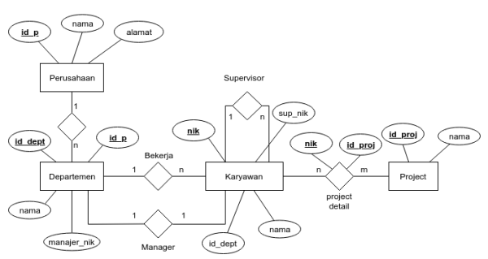

# Input Data Studi Kasus

1. Tabel Perusahaan

    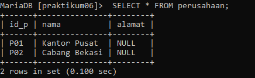

2. Tabel Departemen

    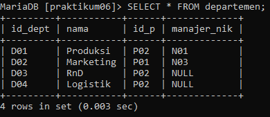

3. Tabel Karyawan

    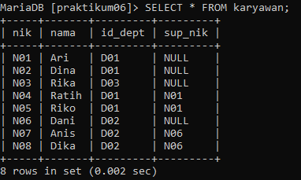

4. Tabel Project

    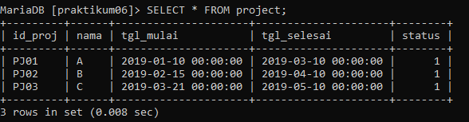

5. Tabel Project Detail

    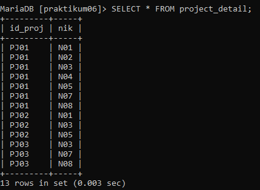


# SQL JOIN

1. Menampilkan Nama Manager tiap Departement

    Script:

    ```sql
    Select Departemen.nama AS Departemen, Karyawan.nama AS Manajer
    FROM Departemen
    LEFT JOIN Karyawan ON Karyawan.nik = Departemen.manajer_nik;
    ```

    Output:

    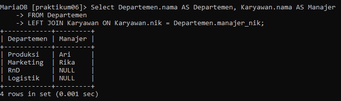

2. Menampilkan Nama Supervisor tiap karyawan

    Script:

    ```sql
    SELECT Karyawan.nik, Karyawan.nama, Departemen.nama AS Departemen, Supervisor.nama AS Supervisor
    FROM Karyawan
    LEFT JOIN Karyawan AS Supervisor ON Supervisor.nik = Karyawan.sup_nik
    LEFT JOIN Departemen ON Departemen.id_dept = Karyawan.id_dept;
    ```

    Output:

    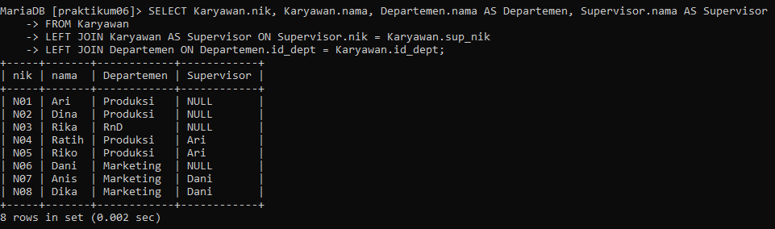

3. Menampilkan daftar karyawan yang bekerja pada project A

    Script:

    ```sql
    SELECT Karyawan.nik, Karyawan.nama
    FROM Karyawan
    JOIN Project_detail ON Project_detail.nik = Karyawan.nik
    JOIN Project ON Project.id_proj = Project_detail.id_proj
    WHERE Project.nama = 'A';
    ```

    Output:

    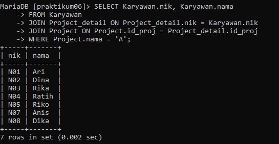


# Latihan Praktikum

1. Departemen apa saja yang terlibat dalam tiap-tiap project

    Script:

    ```sql
    SELECT Project.nama AS Project, GROUP_CONCAT(Departemen.nama) AS Departemen
    FROM Project
    INNER JOIN Project_detail ON Project.id_proj = Project_detail.id_proj
    INNER JOIN Karyawan ON Project_detail.nik = Karyawan.nik
    INNER JOIN Departemen ON Karyawan.id_dept = Departemen.id_dept
    GROUP BY Project.id_proj;
    ```

    Output"

    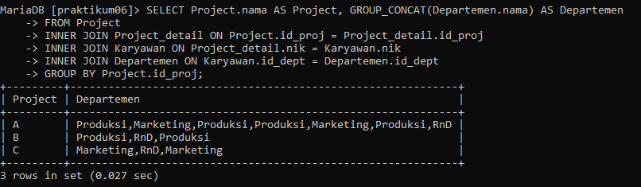

2. Jumlah karyawan tiap departemen yang bekerja pada tiap-tiap project

    Script:

    ```sql
    SELECT Project.nama AS Project, Departemen.nama AS Departemen, COUNT(*) AS 'Jumlah Karyawan'
    FROM Project
    INNER JOIN Project_detail ON Project.id_proj = Project_detail.id_proj
    INNER JOIN Karyawan ON Project_detail.nik = Karyawan.nik
    INNER JOIN Departemen ON Karyawan.id_dept = Departemen.id_dept
    GROUP BY Project.id_proj, Departemen.id_dept;
    ```

    Output:

    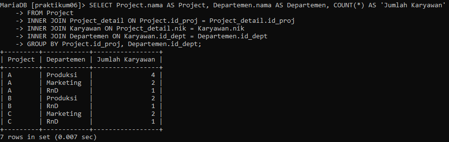

3. Ada berapa project yang sedang dikerjakan oleh departemen RnD? 
(ket: project berjalan adalah yang statusnya 1)

    Script:

    ```sql
    SELECT COUNT(*) AS 'Jumlah Project'
    FROM Project
    INNER JOIN Project_detail ON Project.id_proj = Project_detail.id_proj
    INNER JOIN Karyawan ON Project_detail.nik = Karyawan.nik
    INNER JOIN Departemen ON Karyawan.id_dept = Departemen.id_dept
    WHERE Departemen.nama = 'RnD' AND Project.status = 1;
    ```

    Output:
    
    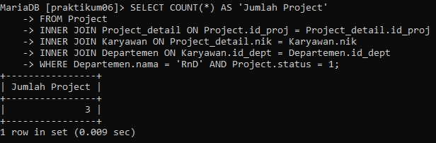

4. Berapa banyak Project yang sedang dikerjakan oleh Ari?

    Script:

    ```sql
    SELECT COUNT(*) AS 'Jumlah Project'
    FROM Project_detail
    INNER JOIN Karyawan ON Project_detail.nik = Karyawan.nik
    WHERE Karyawan.nama = 'Ari' AND Project_detail.id_proj IN (SELECT id_proj FROM Project WHERE status = 1);
    ```

    Output:

    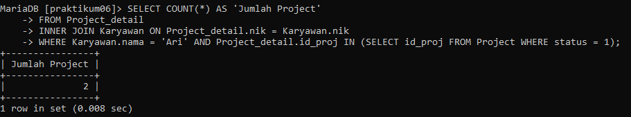

5. Siapa saja yang mengerjakan Project B?

    Script:

    ```sql
    SELECT Karyawan.nama
    FROM Project_detail
    INNER JOIN Karyawan ON Project_detail.nik = Karyawan.nik
    WHERE Project_detail.id_proj IN (SELECT id_proj FROM Project WHERE nama = 'B');
    ```

    Output:

    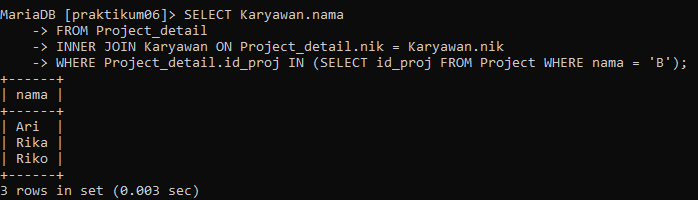


